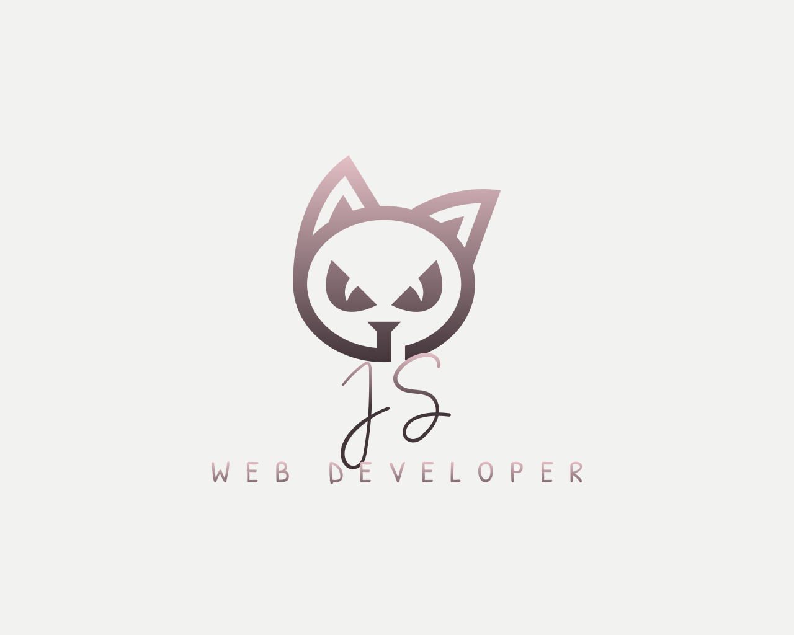

# portfolio-react

## Description
Challenge 20 -- React Portfolio

This project was built in order to embody a seamless fusion of design and technology, catering to individuals with a passion for creativity and innovation. Navigating through its visually captivating interface, users are greeted with an array of engaging sections, including portfolios, blog posts, and contact details. Intuitive navigation ensures effortless exploration, while streamlined registration and login processes facilitate personalized experiences. Interaction is encouraged through commenting and sharing features, fostering a sense of community engagement. With a focus on user convenience and aesthetic appeal, this website serves as a digital showcase of creativity and technical expertise.

## Table of Contents

- [Installation](#installation)
- [Usage](#usage)
- [License](#license)
- [Badges](#badges)
- [Features](#features)
- [Questions](#questions)

## Installation

If just visiting the site, please see the deployed application link in the [Usage](#usage) section, and then use or visit as desired. 

In order to test the code, please use `npm i` in order to install the required dependiencies listed in the package.json, `npm run build` to build the dist folder, and then `npm run start`, or `npm run dev`, to start a local server version. 

## Usage

To visit the deployed application, click the following logo:

Please revisit the [Description](#description) section to review application specific features.

## License

[MIT License](https://opensource.org/licenses/MIT)

## Badges

## Features

For application-specific features, please revisit the [Description](#description) section

* React
* Vite
* JavaScript & JSON
* CSS
* HTML
* Node

## Questions

If you have any questions, feel free to reach out to me via [GitHub](https://github.com/jskelly8/) or email me at jessskelton888@gmail.com.
